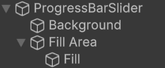
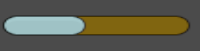

# Unity UI package
The Calluna Games package for Unity UI

## Description
This Unity package implements a solution for the following common UI problems:
- Changing colors of Unity UI elements using a style
- Displaying values via text, progress bars
- Inputing values via input fields, sliders, dropdowns

## Planned Features
- Popup system
- Toast messages

## Dependencies
The package is dependant on the following packages. Please make sure to import them via the package manager.
- [Calluna Core v1.0.3](https://github.com/CallunaGames/CallunaUnityCore)
- [Calluna DI v.1.0.2](https://github.com/CallunaGames/CallunaUnityDI)

## Features
### Value display
The value displays make use of the Calluna Core `Observerable` class or more precisely the `ReadonlyObservable` class. 
If its value changes the display also changes. The observable value is injected into the display class using the Calluna DI. 
Following value types are supported:
- float
- int
- string 

Following visual representation is implemented:
- TextMeshProUGUI Texts (`FloatTextDisplay`, `IntTextDisplay`, `StringTextDisplay`)
- Slider Progress Bar (`ProgressBar`)
- Fillable Images (`FilledImageProgressDisplay`)

#### Example 1: Show float value as progress bar
1. Bind the float value using a MonoInstaller: 
```
public class MyInstaller : MonoInstaller
{
    public override void InstallBindings(Binder binder)
    {
        binder.Bind<ReadonlyObservable<float>>().And<Observable<float>>().ToNew<Observable<float>>().AsSingle();
    }
}
```
2. Add the Installer to a Context like a `SceneContext` or `ObjectContext`
3. Setup a Progress Bar by using an Unity UI slider. Add the `ProgressBar` script to the Slider object. Setup the serialized fields.


4. Optional: Change the float value during runtime to see the progress bar in action
5. Press play



### Value Input

### Color Styles
